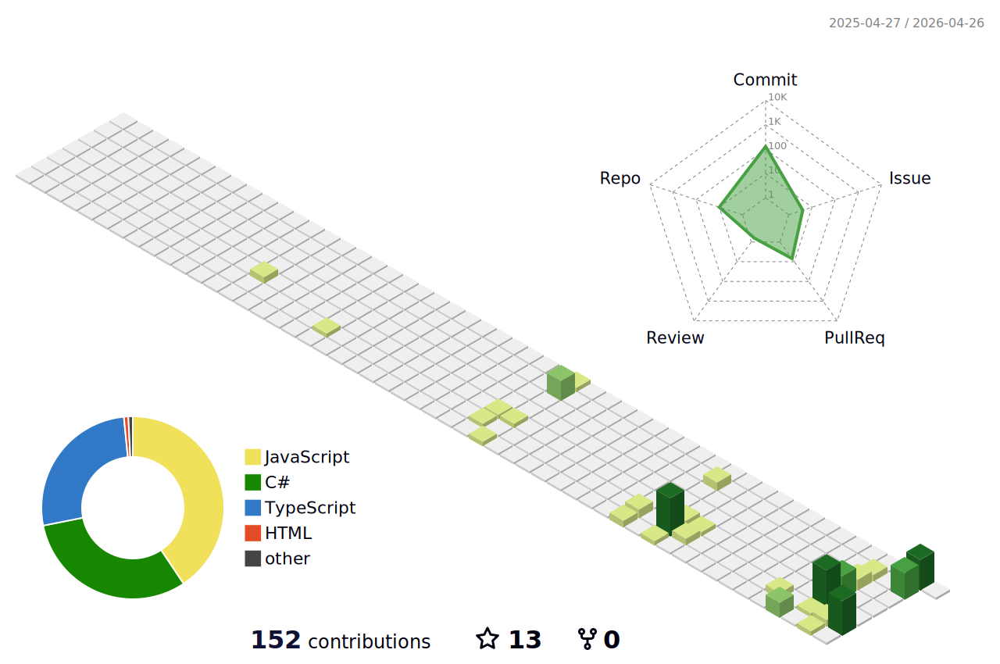

#### WELCOME TO MY WORLD
# 👋 Hi, I’m @vaaakoo
### Middle Backend .NET Developer

- 💼 **Current Focus:** Building robust .NET-based backend systems, REST APIs, and microservices using clean architecture principles.
- ⚙️ **Tech Stack:** Specialized in C#, .NET Core (.NET 6+), Entity Framework, Dapper, and MediatR.
- 🤖 **AI-Powered Development:** Leveraging AI tools like **GitHub Copilot**, **Cursor IDE**, **Gemini**, and **Claude** to accelerate coding, debugging, and building intelligent AI agents.
- 🚀 **Architecture & DevOps:** Experienced with asynchronous messaging (RabbitMQ), relational databases (MS SQL, Oracle, MySQL), and load-balanced environments (IIS, Linux clusters).
- 🌱 **Continuous Growth:** Passionate about scalable system design, secure data handling, and monitoring production environments.

## 🛠️ Tech Stack & Tools

**AI Development Tools & Assistants**

  
  
  
  
  

**Backend & Architecture**

  
  
  
  
  

**Databases, DevOps & Monitoring**

  
  
  
  
  
  
  
  
  
  

**Frontend & Additional Tools**

  
  
  
  
  
  
    
  
  

  

  

 
  <h3 align="center">⚡ GitHub Stats & Activity</h3>
  
    

  

    

  

    
  <picture>
    <source
      media="(prefers-color-scheme: dark)"
      srcset="https://raw.githubusercontent.com/giorgitchanturidze/giorgitchanturidze/output/github-contribution-grid-snake-dark.svg"
    />
    <source
      media="(prefers-color-scheme: light)"
      srcset="https://raw.githubusercontent.com/giorgitchanturidze/giorgitchanturidze/output/github-contribution-grid-snake.svg"
    />
    
  </picture>
  
  

  

