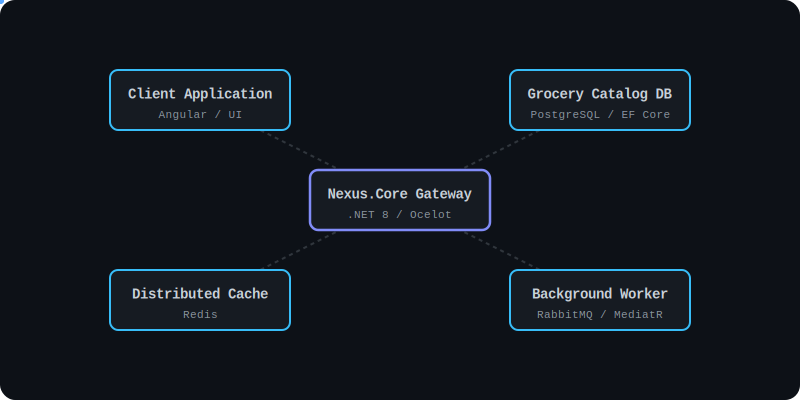
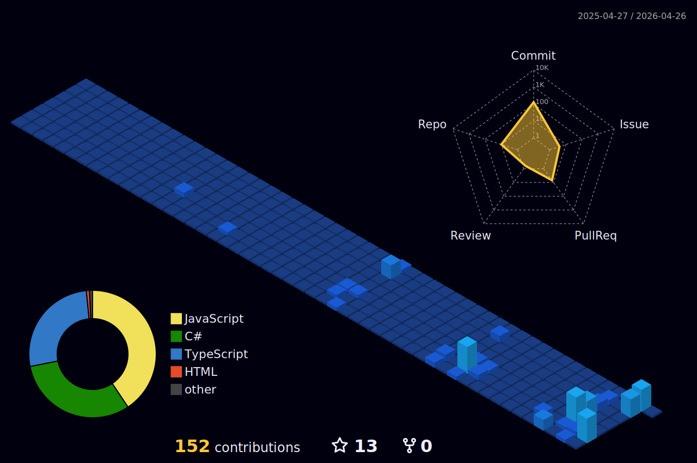

  <h1 align="center">
    👋 Hi, I'm Vako Janikashvili
    
  </h1>

 

<h3 align="center">Backend .NET Developer</h3>

  Backend engineer focused on building scalable, reliable systems with clean architecture and high performance.

  

  

  

  

---

## 💼 About Me

- 💼 Designing and developing **high-performance backend systems** using .NET  
- ⚙️ Strong expertise in **C#, .NET 6+, EF Core, Dapper, MediatR**  
- 🧠 Focused on **clean architecture, scalability, and maintainability**  
- 🚀 Experience building **microservices and distributed systems**  
- 🔐 Working with **secure APIs, financial flows, and data integrity**  
- 🤖 Leveraging AI tools (**Copilot, Cursor, Gemini, Claude**) for productivity  

---

## 🛠️ Tech Stack

### 🤖 AI Development Tools

  
  
  
  

---

### ⚙️ Backend & Architecture

  
  
  
  
  

---

### 🗄️ Databases, DevOps & Monitoring

  
  
  
  
  
  
  
  
  
  

---

### 🌐 Frontend & Tools

  
  
  
  
  
  
  
  

---

## 📊 GitHub Stats

  

---

## 📫 Contact

  
  

---

  

---

<pre>
██████╗  █████╗  ██████╗██╗  ██╗███████╗███╗   ██╗██████╗ 
██╔══██╗██╔══██╗██╔════╝██║ ██╔╝██╔════╝████╗  ██║██╔══██╗
██████╔╝███████║██║     █████╔╝ █████╗  ██╔██╗ ██║██║  ██║
██╔══██╗██╔══██║██║     ██╔═██╗ ██╔══╝  ██║╚██╗██║██║  ██║
██████╔╝██║  ██║╚██████╗██║  ██╗███████╗██║ ╚████║██████╔╝

██████╗ ███████╗██╗   ██╗███████╗██╗      ██████╗ ██████╗ ███████╗██████╗ 
██╔══██╗██╔════╝██║   ██║██╔════╝██║     ██╔═══██╗██╔══██╗██╔════╝██╔══██╗
██║  ██║█████╗  ██║   ██║█████╗  ██║     ██║   ██║██████╔╝█████╗  ██████╔╝
██║  ██║██╔══╝  ╚██╗ ██╔╝██╔══╝  ██║     ██║   ██║██╔═══╝ ██╔══╝  ██╔══██╗
██████╔╝███████╗ ╚████╔╝ ███████╗███████╗╚██████╔╝██║     ███████╗██║  ██║
</pre>
